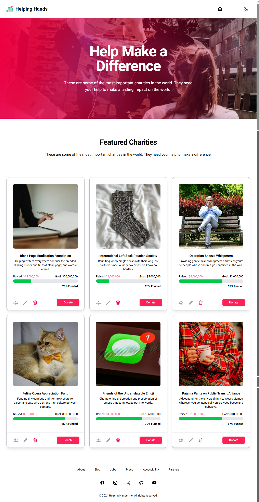

# Helping Hands 🖐️

**Helping Hands** is a responsive, interactive landing page application for a fictional charity gallery. Built with **Next.js** and **TypeScript**, it allows users to browse and manage charities, make donations, and view live donor progress per charity.

This project showcases reusable component architecture, responsive design, local data persistence, and dark/light theme support. Ideal for recruiters and clients looking to see practical, clean, modern React-based development.

<a href="https://reactdemohelpinghands.netlify.app/" target="_blank" rel="noopener noreferrer">🌐 Live Demo</a>

------

## ✨ Features

- Add, edit, and delete charities
- Donate to individual charities
- View donation progress with animated progress bars
- View donor history per charity
- Fully responsive design across devices
- Dark and light mode toggle
- Modular, reusable React component design using Tailwind CSS

------

## 🧑‍💻 Tech Stack

- **Framework**: [Next.js](https://nextjs.org/) with [TypeScript](https://www.typescriptlang.org/)
- **Styling**: [Tailwind CSS](https://tailwindcss.com/)
- **State Management**: React `useState`/`useEffect` + `local`
- **Deployment**: [Vercel](https://vercel.com/) *(placeholder link for now)*

------

## 📁 Project Structure

```
src/
├── app/                # App Router structure (layout.tsx, page.tsx, etc.)
├── components/         # Reusable UI components (buttons, modals, cards, etc.)
├── utils/              # Utility functions (e.g. localStorage helpers)
```

------

## 🚀 Getting Started

```
bashCopyEdit# Clone the repo
git clone https://github.com/blindeenlightz/HelpingHands.git
cd HelpingHands

# Install dependencies
npm install

# Run in development
npm run dev

# Build for production
npm run build
npm start
```

------

## 🌙 Dark Mode

Dark/light mode can be toggled in the UI.

------

## 📸 Screenshots





------

## 🧠 Design Philosophy

- Emphasize reusable, composable components
- Responsive-first UI with Tailwind CSS utilities
- Clear state updates and user feedback for donations

------

## 📬 Contact

Created by <a href="https://jamiebraaksma.dev" target="_blank" rel="noopener noreferrer">Jamie Braaksma</a>
 Feel free to reach out on <a href="https://www.linkedin.com/in/jamie-braaksma-b32273223" target="_blank" rel="noopener noreferrer">LinkedIn</a> or explore more on <a href="https://github.com/Blindeenlightz" target="_blank" rel="noopener noreferrer">GitHub</a>
